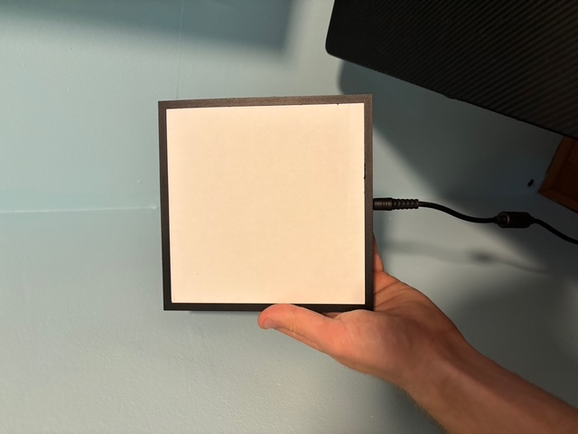
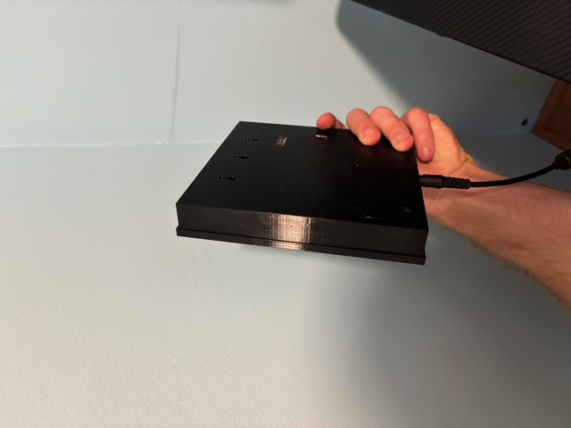
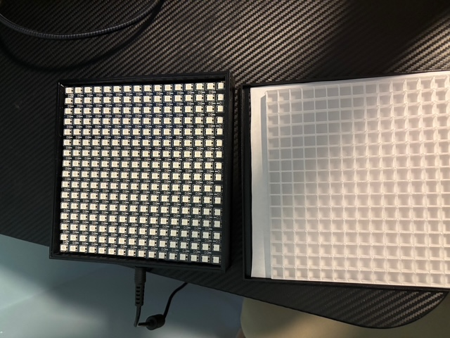
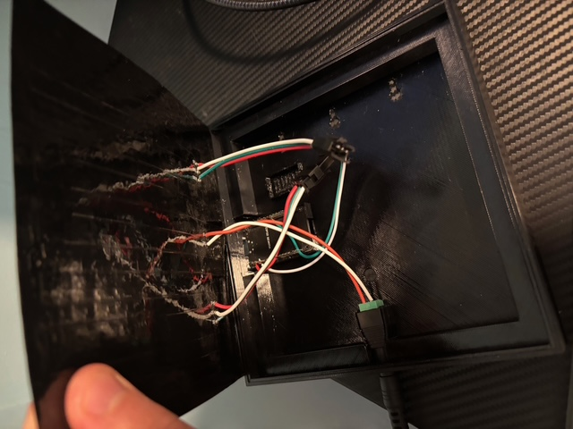

# Light Phone
A LED display that moves a lava lamp like pattern across a screen and flashes red when you get a important notification 

## Demo 
[![Alt text]](./visuals/demo.MP4)  

## Why I am building this
Me checking my phone often takes me out of the flow state when I am trying to be productive at my computer.  
I try to put my phone out of sight when I want to stay focused, but in the back of my mind I am concerned I might miss an urgent notification.  
I regularly find myself looking at my phone lock screen to check it for any important notifications.  
The Light Phone will act as a passive background display I can put in my FOV to put my mind at ease.  
It will only update its display when I get a certain type of notification, e.g. a text from a family member.   
In the future I can add some semantic parsing to see if a text message is actually urgent, but that is just a nice to have for now. 

## Hardware Up Close
 
 
 
 

### Dependencies (VERSIONS MUST BE MATCHED)
1. [esp32 Board Package version 1.0.6](https://github.com/espressif/arduino-esp32/releases/tag/1.0.6)
2. [ESP32 ANCS library version 0.0.1](https://github.com/Smartphone-Companions/ESP32-ANCS-Notifications/releases/tag/v0.0.1)
3. [FastLED version 3.5.0](https://github.com/FastLED/FastLED/releases/tag/3.5.0)
