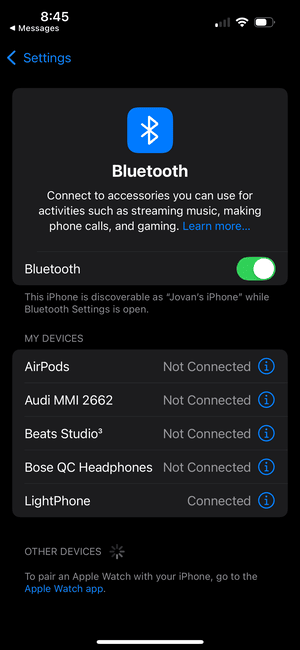

# Light Phone
A LED display that moves a lava lamp like pattern across a screen and flashes red when you get a important iPhone notification.

## Demo 

#### Default State

#### Important Notification received

## Why I Built it
Checking my phone takes me out of the flow state when I am trying to be productive at my computer.
I try to put my phone out of sight when I want to stay focused, but in the back of my mind I am concerned I might miss an important notification.
The Light Phone acts as a passive background display I can put in my FOV to put my mind at ease.
By default it is a relaxing lava lamp like display, but whenever I get an important notification (i.e. text from mom) it flashes red.

## Hardware Up Close
 
 
 
 
### BLE Connection

## How it Works
Inside is just an ESP32 hooked up to a 16x16 led display.
The ESP32 runs two RTOS tasks (update LED display, and run Bluetooth ops). The Bluetooth ops took the most time to get working out of anything on this project.
It is a Bluetooth Low Energy (BLE) protocol, specifically a Apple Notification Center Service (ANCS) Central & Peripheral device that can connect to your iPhone.
The BLE system before it connects acts as a Central device and searches for a ANCS Peripheral device (i.e. your iPhone) to connect to. Once the two devices find eachother the Light Phone subcribes to your iPhones ANCS service and connects. The BLE system then switches to being a Peripheral device and your iPhone becomes the Central device, the iPhone then streams notification data packets to your Light Phone.
When your Light Phone gets a notification data packet it parses it and checks to see if any of the important contacts are referenced in the notification. If an important contact is referenced,
the BLE task sets a notification received flag which triggers a flashing red pattern to pulse on the LED display for 30 sec. Once the red pattern is done flashing,
the Light Phone goes back to its default Lava Lamp display.

### Software Dependencies (VERSIONS MUST BE MATCHED)
1. [esp32 Board Package version 1.0.6](https://github.com/espressif/arduino-esp32/releases/tag/1.0.6)
2. [ESP32 ANCS library version 0.0.1](https://github.com/Smartphone-Companions/ESP32-ANCS-Notifications/releases/tag/v0.0.1)
3. [FastLED version 3.5.0](https://github.com/FastLED/FastLED/releases/tag/3.5.0)

### Hardware
1. ESP-WROOM-32 ($3)
2. 16x16 WS2812b LED Matrix ($15)
3. [3D printed enclosure](https://www.printables.com/model/705945-16x16-led-matrix-frame-with-diffuser-grid/files) (~free)
